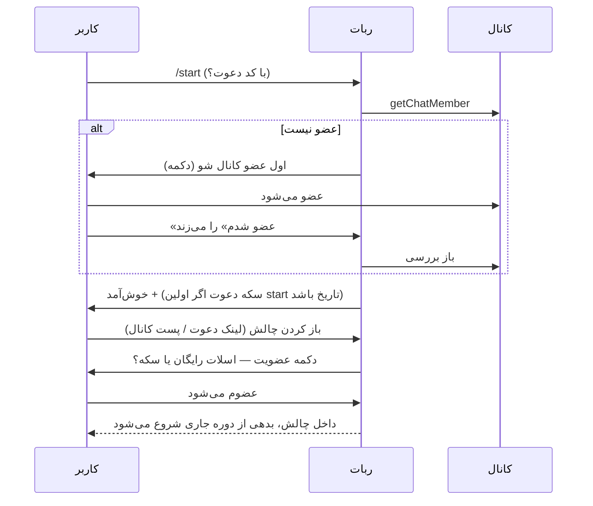
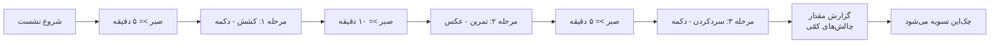
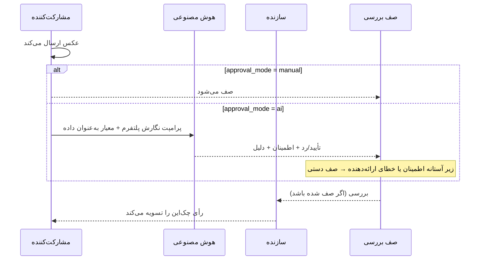
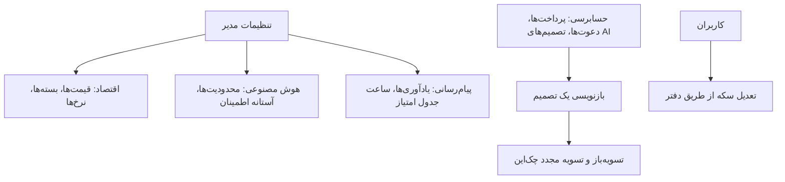

# پلتفرم چطور کار می‌کند — مشارکت‌کنندگان، سازنده‌ها، مدیران

> **English:** this document is also available in English — [user-flows.md](user-flows.md)

این سند نحوه کار پلتفرم را از دید سه مخاطب آن قدم‌به‌قدم مرور می‌کند. این سند رفتار ساخته‌شده را بازتاب می‌دهد، نه نیّت‌ها را. برای مطالب ویژه توسعه‌دهنده [README](../README.fa.md) را ببینید؛ برای استقرار [setup-cpanel.fa.md](setup-cpanel.fa.md) / [setup-vps.fa.md](setup-vps.fa.md).

همه آنچه در پایین می‌آید روی **هم تلگرام و هم بله** اتفاق می‌افتد مگر خلافش ذکر شود — دو پیام‌رسان جریان‌های مشترک، قوانین مشترک و Actionهای مشترک دارند؛ فقط ریل پرداخت و چند قابلیت پلتفرمی فرق می‌کند (در بخش محدودیت‌های README مستند شده).

---

## ۱. مشارکت‌کنندگان

### کشف و عضویت

مشارکت‌کننده از یکی از دو راه می‌رسد:

- **لینک عمیق دعوت** — ‏`https://t.me/<bot>?start=<code>` (یا `https://ble.ir/<bot>?start=<code>`).
  فرمان `/start` کد دعوت را حمل می‌کند و دعوت‌کننده فقط در صورتی سکه می‌گیرد که این **اولین تماس همیشگی** دعوت‌شده با ربات باشد — کاربری که از قبل وجود داشته، چیزی به دعوت‌کننده نمی‌دهد.
- **کانال عمومی** — چالش‌های عمومی به‌صورت خودکار در کانال اعلانات پلتفرم اعلام می‌شوند؛ تپ‌کردن لینک به همان مسیر عضویت می‌رسد.

نخستین چیزی که هر کاربر جدید می‌بیند **دروازه کانال** است: ربات عضویت در کانال اعلانات را بررسی می‌کند (با `getChatMember`) و تا کاربر عضو نشده، تنها چیزی که می‌گیرد یک دکمه عضویت است. این دروازه در اقدامات حساس هم دوباره بررسی می‌شود، نه فقط در `/start`.

عضویت در چالش یک **اسلات** می‌خواهد: هر کس یک اسلات رایگان ساخت و یک اسلات رایگان عضویت دارد. فراتر از آن‌ها، اسلات عضویت با سکه خرج می‌شود — یا اگر دعوتِ سکه‌دار بوده، از اعتبار دعوت. قیمت‌ها در پنل مدیر تعیین می‌شوند؛ هیچ‌چیز هاردکد نیست.

**کاربر دیررس هرگز برای گذشته جریمه نمی‌شود.** چالش یک خط زمانی ثابت و مشترک برای همه دارد؛ کسی که در دوره ۵ از ۳۰ می‌پیوندد تا دوره ۵ هیچ بدهی‌ای ندارد.

### چک‌این، به تفکیک نوع اثبات

در هر دوره ربات یک **یادآوری** می‌فرستد. `/checkin` (یا مینی‌اپ) نشان می‌دهد دوره جاری چه چیزی می‌خواهد. معنای «چک‌این» به نوع اثبات چالش بستگی دارد:

| نوع اثبات | کاربر چه می‌کند | چه اتفاقی می‌افتد |
|---|---|---|
| `button` | یک دکمه را می‌زند | فوراً و به‌صورت خودکار تأیید می‌شود |
| `text_autogen` | از ربات عبارت را می‌خواهد و تایپش می‌کند | با تطابق دقیق نرمال‌شده خودکار تأیید می‌شود — عبارت **به‌ازای هر مشارکت‌کننده** یکتاست، پس عبارت دوست بی‌فایده است |
| `image_approval` | عکس بارگذاری می‌کند | به صف بررسی سازنده (یا به هوش مصنوعی — بخش ۲) می‌رود؛ بعداً تأیید/رد می‌شود |
| `voice` | پیام صوتی زیر سقف مدت چالش می‌فرستد | به‌عنوان اثبات ذخیره و مانند عکس بررسی می‌شود |
| `timed_session` | یک نشست چندمرحله‌ای را طی می‌کند | مثال عملی پایین ↓ |

در چالش‌های **امتیاز کمّی** کاربر یک عدد هم گزارش می‌دهد (صفحه، کیلومتر، شنا). مقدار همراه اثبات گرفته می‌شود — در نشست زمان‌بندی‌شده، در مرحله آخر — و به‌طور نسبی نسبت به هدف امتیاز می‌گیرد.

### یک نشست زمان‌بندی‌شده، قدم‌به‌قدم

فرض کنید سازنده نشست ۳ مرحله‌ای طراحی کرده: *کشش* (دکمه، حداقل ۵ دقیقه بعد از شروع)، *تمرین* (عکس، حداقل ۱۰ دقیقه)، *سردکردن* (دکمه، حداقل ۵ دقیقه). وقتی دوره باز شود:

1. **شروع** — مشارکت‌کننده دکمه *شروع نشست* را روی پیام چک‌این می‌زند. ربات تأیید می‌کند و برچسب مرحله ۱ با صبرش را نشان می‌دهد: «کشش — تا ۵:۰۰ دیگر آماده است.»
2. **صبر** — زودخواستن مرحله ۱ با نمایش ثانیه‌های باقی‌مانده رد می‌شود، نه اینکه بی‌صدا پذیرفته شود. صبر خودِ هدف است؛ «چقدر مونده؟» هم پاسخ صادقانه می‌گیرد.
3. **مرحله ۱** — کاربر مرحله را انجام و خواسته‌اش را ارسال می‌کند (اینجا: تپ دکمه). ربات ثبت می‌کند و برچسب مرحله ۲ را نشان می‌دهد: «تمرین با عکس — تا ۱۰:۰۰ دیگر آماده است.»
4. **مرحله ۲** — بعد از صبر، عکس آپلود می‌شود. (مرحله ویس به‌جایش پیام صوتی می‌خواهد و بالاتر از سقف مدت مرحله را رد می‌کند — مدت گزارش‌شده تلگرام/بله مرجع است، از کاربر ارسال مجدد خواسته می‌شود، هیچی بریده نمی‌شود.)
5. **مرحله ۳ → پایان** — دکمه سردکردن نشست را کامل می‌کند. در چالش کمّی همین لحظه ربات عدد را می‌پرسد. نشست کامل می‌شود و چک‌این از طریق همان Action تسویه‌ای که هر نوع اثبات دیگر استفاده می‌کند بسته می‌شود.

نشست‌ها با replay قابل بازی‌کردن نیستند: ارسال مراحل خارج از ترتیب یا ارسال مجدد مرحله تمام‌شده رد می‌شود، Startِ دوبار لمس‌شده یک نشست می‌سازد نه دو تا، و نشست ناتمام در پایان دوره صرفاً یک چک‌این نیست — مثل هر غیبتی miss می‌شود (یا فریز می‌سوزاند).

### فریزها، غیبت‌ها و استریک‌ها

- دوره‌ای که بدون چک‌ین تمام می‌شود نخست می‌کوشد یک **فریز مصرف کند** — خودکار، کاربر کاری نمی‌کند. دوره *frozen* ثبت و استریک زنده می‌ماند.
- **فریز نمانده → استریک صفر می‌شود — اما مشارکت‌کننده در چالش می‌ماند.** ممکن است با دعوت دوست عضو شده باشد؛ یک روز جاگذاشتن آن را نمی‌سوزاند.
- قانون سخت‌گیرانه‌تر حذف خودکار ممکن است بعداً بیاید؛ امروز حذف فقط با اقدام سازنده/مدیر یا خروج خودِ کاربر است.

### صفحه وضعیت مینی‌اپ

باز کردن مینی‌اپ (دکمه در ربات) کاربر را بی‌صدا از طریق `initData` تلگرام احراز می‌کند و نشان می‌دهد: هر چالشی که کاربر در آن است، برای هرکدام استریک (یا مجموع امتیاز)، فریزهای مصرفی/باقی، کل دوره‌ها، دوره بازِ فعلی با بدهی‌اش، و تاریخچه تسویه‌شده. چک‌این از مینی‌اپ و از ربات از **همان Action** عبور می‌کند — یکی هرگز با دیگری نمی‌تواند اختلاف داشته باشد. زبان از ترجیح ذخیره‌شده کاربر می‌آید؛ کاربر فارسی‌زبان رابط کاملاً راست‌به‌چپ می‌گیرد.

### تمام‌شدن اسلات‌های رایگان — خرید سکه

`/shop` بسته‌های سکه را با قیمتِ ارز خودِ پیام‌رسان نشان می‌دهد: **تلگرام استارز** در تلگرام، **ریال با پرداخت بله** در بله. پرداخت بومی است (فاکتور استارز / فاکتور بله)، سکه‌ها لحظه تأیید پرداخت اعتبار می‌شوند — هرگز دو بار، حتی اگر پیام‌رسان رویداد پرداخت را دوباره تحویل دهد — و بلافاصله برای اسلات‌ها و فریزها قابل خرج‌اند. سکه به‌صورت رایگان هم می‌رسد: دعوت‌های سکه‌دار، پاداش کامل‌کردن چالش و (به‌ندرت) تعدیل مدیر.

---

## ۲. سازنده‌ها

### طراحی چالش

`/create` یک ویزارد راهنما باز می‌کند: عنوان → توضیحات → نوع دوره (روزانه/هفتگی/ماهانه/فصلی/سالانه/سفارشی، با تعداد روز برای سفارشی) → منطقه‌زمانی → تاریخ شروع → طول بر حسب دوره → امتیازدهی (استریک دودویی، یا کمّی با هدف، واحد، امتیاز پایه و اینکه زیر هدف قبول است یا نه) → نحوه اثبات هر دوره → حالت بررسی برای اثبات عکس (دستی/هوش مصنوعی) → دید (عمومی / فقط دعوتی) → نوع جریان (ارسال تک‌مرحله‌ای، یا نشست زمان‌بندی‌شده که طراحی مراحل را باز می‌کند). سهمیه فریز از تنظیم پیش‌فرض مدیر می‌آید، نه از ویزارد. هر سؤال تا پاسخ معتبر شود دوباره پرسیده می‌شود؛ `/cancel` پیش‌نویس را بدون خرج هیچ چیزی رها می‌کند.

انتخاب اثبات **نشست زمان‌بندی‌شده** ویزارد را به طراحی مرحله می‌برد: چند مرحله، بعد به‌ازای هر مرحله حداقل صبر، نوع ورودی (دکمه / عکس / ویس، با سقف مدت برای ویس) و برچسب. طراحی به‌صورت کل اعتبارسنجی می‌شود — مجموع حداقل صبرها نمی‌تواند از طول یک دوره بیشتر باشد، پس چالش روزانه نمی‌تواند ۳۰ ساعت صبر بخواهد. وقتی مشارکت‌کننده دارد، طراحی عوض نمی‌شود.

چالش **عمومی** به‌طور خودکار در کانال پلتفرم اعلام می‌شود؛ چالش **فقط دعوتی** با لینک دعوتش همگام می‌شود. به هر حال سازنده لینک‌های دعوت در دست دارد — هرکدام به قوانین سکه‌دهی بالا وصل است.

### تأیید اثبات با کمک هوش مصنوعی

در چالش‌های `image_approval` سازنده یک حالت بررسی برمی‌گزیند: **دستی** (پیش‌فرض) یا **هوش مصنوعی**. انتخاب هوش مصنوعی با احتیاط از بخش امنیتیش می‌گذرد:

1. پلتفرم **معیارهای پیشنهادی** از عنوان و توضیح چالش تولید می‌کند (مثلاً «یک بشقاب غذا با سبزیجات قابل مشاهده» برای چالش تغذیه سالم). مسیر توصیه‌شده پذیرش یا ویرایش جزئی پیشنهاد است — عمداً، چون معیارها تنها متن کاربرند که بعداً داخل یک پرامپت به مدلی با نقش تصمیم‌گیر می‌روند.
2. سازنده می‌تواند معیار خودش را بنویسد، اما متن سقف دارد (~۵۰۰ کاراکتر ساده) و **پیش از ذخیره غربال می‌شود**: یک پاس محافظ می‌گردد دنبال تلاش برای منحرف‌کردن بازبین («قوانین قبلی را نادیده بگیر»، ادعای اختیار سیستمی)، و هر چه پرچم شود به بررسی مدیر می‌رود نه اینکه ذخیره شود.

هوش مصنوعی با عکس ارسالی چه می‌کند: پرامپت بررسی **کاملاً نگارش پلتفرم** است؛ معیار سازنده به‌عنوان *داده* با محدوده روشن و برچسب صراحتاً «فقط توصیفی» همراه می‌شود؛ و مدل باید در یک schema قفل‌شده پاسخ دهد — تأیید/رد، امتیاز اطمینان، دلیل. ابزاری ندارد و در هیچ‌چیز دیگری نظری ندارد؛ بدترین سناریوی یک ارسال دستکاری‌شده یک تأیید/رد اشتباه است که بازنویسی می‌تواند معکوسش کند.

**هیچ چیز مهمی فقط به اطمینان مدل سپرده نمی‌شود**: تصمیمی زیر آستانه اطمینانِ تنظیم‌شده توسط مدیر، یا هر خطا/تایم‌اوت ارائه‌دهنده، به همان صف دستی می‌افتد که چالش دستی استفاده می‌کند. هر تصمیم — ارائه‌دهنده، مدل، رأی، اطمینان، دلیل، تأخیر — برای حسابرسی لاگ می‌شود.

### اتصال گروه یا کانال

`/chatlink` چالش را به گروه/کانالی که **سازنده مالکش است** وصل می‌کند. سازنده پیامی از آن گفتگو را به ربات فوروارد می‌کند؛ پلتفرم پیش از پذیرش بررسی می‌کند ربات با حقوق لازم حاضر باشد. پس از اتصال، سه کلید به‌ازای هر گفتگو:

| کلید | چه می‌کند |
|---|---|
| `post_checkin_announcements` | هر بار کسی چک‌ین کند «X چک‌ین کرد — دوره ۴/۳۰، استریک ۱۲ 🔥» را پست می‌کند (با امتیاز در چالش‌های کمّی) |
| `post_daily_leaderboard` | جدول امتیاز روزانه را در ساعت تنظیم‌شده، به منطقه‌زمانی خود چالش پست می‌کند |
| `share_proof_media` | خودِ **عکس** تأییدشده را به اعلان می‌چسباند — فقط وقتی اثبات‌های چالش عمومی‌اند، و در لحظه ارسال دوباره بررسی می‌شود، هرگز از لحظه dispatch اعتماد نمی‌شود |

هر کسی در گفتگو می‌تواند **`/leaderboard`** را تایپ کند تا جدول را در لحظه بگیرد (محدود به یک بار هر چند دقیقه به‌ازای هر گفتگو). آنچه جدول رتبه‌بندی می‌کند از امتیازدهی چالش می‌آید: استریک در دودویی، مجموع امتیاز در کمّی.

### بررسی اثبات‌ها

در چالش‌های دستی (یا fallback هوش مصنوعی)، ارسال‌ها با عکس/ویس و گزارش مشارکت‌کننده به صف بررسی سازنده می‌رسند. دکمه‌های تأیید/رد چک‌این را از همان Action تسویه‌ای که همه‌چیز دیگر استفاده می‌کند می‌بندند — تأییدی پس از پایان دوره هم درست حساب می‌شود، و رد دلیلش را روشن می‌گوید (کاربر دلیل واضحی می‌بیند، نه سکوت).

---

## ۳. مدیران

پنل مدیر سطحی جداست، با احراز هویت نشستی در `/admin` (ایمیل + رمز — عمداً نه هویت تلگرامی). صفحاتش:

| صفحه | برای چه |
|---|---|
| **Settings** | کل اقتصاد و همه آستانه‌ها: قیمت سکه، قیمت اسلات/فریز، بسته‌های استارز و ریال، نرخ دعوت→سکه، فریزهای پیش‌فرض، TTL توکن‌ها، زمان یادآوری، ساعت پست جدول امتیاز، محدودیت‌ها و آستانه اطمینان هوش مصنوعی، نگهداشت رسانه اثبات |
| **Challenges** | همه چالش‌ها با خط زمانی، مشارکت‌کنندگان و وضعیت؛ اقدامات مدیریت |
| **Users** | همه حساب‌ها در هر دو پلتفرم؛ تعدیل سکه (از طریق دفتر، با دلیل و کلید idempotency — هرگز موجودیِ دست‌ویرایش‌شده) |
| **Invites** | حسابرسی دعوت‌ها: چه کسی چه کسی را دعوت کرد، چه چیزی اعتبار شد و چرا |
| **Payments** | هر خرید روی هر دو ریل — استارز و پرداخت بله — با بازپرداخت جایی که ریل پشتیبانی می‌کند (استارز بله، بله نه: ریلش endpoint بازپرداخت ندارد، پس ردیف‌های بله فقط قابل مشاهده‌اند) |
| **Reviews** | لاگ حسابرسی تأیید هوش مصنوعی و صف دستی |

### حسابرسی هوش مصنوعی و بازنویسی‌ها

هر تصمیم هوش مصنوعی یک ردیف است: کدام ارائه‌دهنده/مدل، رأی، اطمینان، دلیل اعلام‌شده، تأخیر، و روی کدام ارسال. مدیری که با تصمیمی مخالف است می‌تواند آن را **بازنویسی کند** — حتی تصمیمی که چک‌ینی را تسویه کرده. بازنویسی‌ای که چک‌این تسویه‌شده را برمی‌گرداند از یک Action معکوس می‌گذرد که چک‌این را درست تسویه‌باز و دوباره تسویه می‌کند: استریک‌ها، امتیازها و اعلان‌ها طوری اصلاح می‌شوند که انگار رأی اولیه همان رأی جدید بوده، نه وصله‌کاری درجا.

### تنظیم نرخ‌ها و قیمت‌ها

هر عددی که یک اپراتور بتواند بخواهد جابه‌جا کند در Settings است، تغییرها در لحظه خواندن اعمال می‌شوند و هرکدام اعتبارسنجی دارند — قیمت بسته‌ها در هر دو ارز، به‌ازای هر ریل؛ آستانه‌ها در بازه معقول. این پاسخ طراحی‌شده به «می‌شود X را عوض کرد؟» است: در پنل عوضش کنید؛ اگر در پنل نیست، قرار نیست به‌ازای هر استقرار عوض شود.

