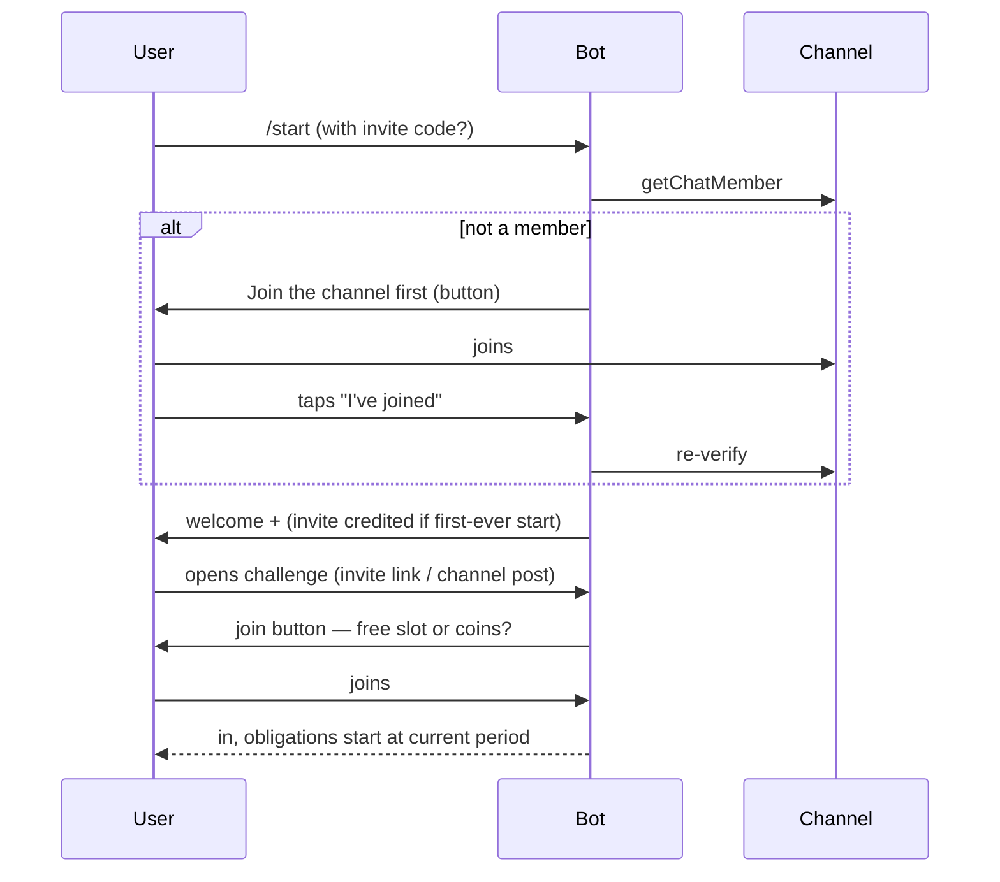
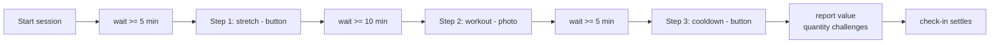
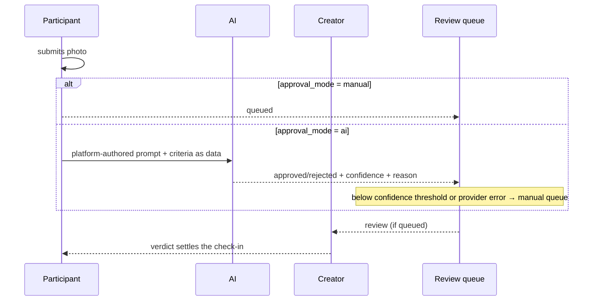
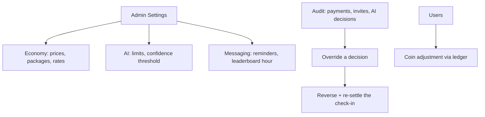

# How the platform works — participants, creators, admins

> **فارسی:** این سند به فارسی نیز موجود است — [user-flows.fa.md](user-flows.fa.md)

This document walks through the platform as its three audiences actually experience it. It reflects
built behaviour, not intentions. For developer-facing material see the [README](../README.md); for
deployment see [setup-cpanel.md](setup-cpanel.md) / [setup-vps.md](setup-vps.md).

Everything below happens on **both Telegram and Bale** unless noted — the two messengers share the
same flows, the same rules and the same Actions; only the payment rail and a few platform
capabilities differ (documented in the README's known-limitations section).

---

## 1. Participants

### Discovering and joining

A participant arrives in one of two ways:

- **An invite deep link** — `https://t.me/<bot>?start=<code>` (or `https://ble.ir/<bot>?start=<code>`).
  The `/start` command carries the invite code, and the inviter earns coins **only if this is the
  invitee's first-ever contact with the bot** — a user who already exists earns the inviter nothing.
- **The public channel** — public challenges are auto-announced to the platform's announcement
  channel; tapping through lands on the same join path.

The first thing every new user meets is the **channel gate**: the bot checks membership of the
announcement channel (via `getChatMember`), and until the user joins it, the only thing they get is a
join button. The gate is re-checked on privileged actions, not just at `/start`.

Joining a challenge costs a **slot**: everyone gets one free create-slot and one free join-slot.
Beyond those, a join-slot is spent from coins — or, if the invite was a credited one, from the invite
credit. Prices are set in the admin panel; nothing is hardcoded.

**Late joiners are never penalised for the past.** A challenge runs one shared, fixed timeline for
everybody; a participant who joins at period 5 of 30 simply owes nothing until period 5.

### Checking in, per proof type

Every period, the bot sends a **reminder**. `/checkin` (or the Mini App) shows what the current
period owes. What "checking in" means depends on the challenge's proof type:

| Proof type | What the participant does | What happens |
|---|---|---|
| `button` | Taps one button | Auto-approved instantly |
| `text_autogen` | Asks the bot for the phrase, then types it | Auto-approved on normalised exact match — the phrase is unique **per participant**, so a friend's phrase is useless |
| `image_approval` | Uploads a photo | Goes to the creator's review queue (or to AI — see §2); approved/rejected later |
| `voice` | Sends a voice message under the challenge's duration cap | Stored as proof, reviewed like a photo |
| `timed_session` | Works through a multi-step session | See the walkthrough below |

On **quantity-scored** challenges the participant also reports a number (pages, km, push-ups). The
value is captured with the proof — for a timed session, at the final step — and scores points
proportionally against the target.

### A timed session, walked through

Suppose a creator designed a 3-step session: *stretch* (button, wait ≥ 5 min after start), *workout*
(photo, wait ≥ 10 min), *cooldown* (button, wait ≥ 5 min). When the period opens:

1. **Start** — the participant taps *Start session* on the check-in prompt. The bot acknowledges and
   shows step 1's label with its wait: "Stretch — ready in 5:00."
2. **Wait** — asking for step 1 early is refused with the seconds remaining, not silently accepted.
   The wait is the point; tapping "what's left?" gets an honest answer.
3. **Step 1** — the participant performs the step and submits what it asks for (here: a button tap).
   The bot records it, shows step 2's label: "Workout with a photo — ready in 10:00."
4. **Step 2** — after the wait, a photo is uploaded. (A voice step instead asks for a voice message
   and rejects one over the step's duration cap — Telegram/Bale's reported duration is authoritative,
   the participant is asked to resend, nothing is truncated.)
5. **Step 3 → end** — the cooldown button completes the session. On a quantity challenge this is the
   moment the bot asks for the number. The session completes and the check-in settles through the
   same settlement Action every other proof type uses.

Sessions can't be gamed by replay: submitting steps out of order or re-submitting a finished step is
refused, a double-tapped Start creates one session, not two, and an unfinished session when the
period ends is simply not a check-in — it misses (or burns a freeze) like any other miss.

### Freezes, misses, and streaks

- A period that ends with no check-in first tries to **consume a freeze** — automatically, the
  participant does nothing. The period is recorded as *frozen* and the streak survives.
- **No freeze left → the streak resets to zero — but the participant stays in the challenge.** They
  may have joined on a friend's invite; missing a day doesn't burn that.
- A stricter auto-remove rule may come later; today, removal only happens by creator/admin action or
  leaving.

### The Mini App status screen

Opening the Mini App (button in the bot) authenticates silently via Telegram's `initData` and shows:
every challenge the user is in, for each the streak (or total score), freezes used/remaining,
periods total, the currently open period with what it owes, and the settled history. Checking in
from the Mini App and from the bot run through the **same Action** — one can never disagree with the
other. Language follows the user's stored preference; Farsi users get a fully right-to-left
interface.

### Running out of free slots — buying coins

`/shop` shows the coin packages with prices in the messenger's own currency: **Telegram Stars** on
Telegram, **Rial via Bale Pay** on Bale. Paying is native (Stars invoice / Bale invoice), coins are
credited the moment the payment is confirmed — never twice, even if the messenger re-delivers the
payment event — and immediately spendable on create-slots, join-slots and freezes. Coins also arrive
free: credited invites, challenge completion rewards, and (rarely) admin adjustments.

---

## 2. Creators

### Designing a challenge

`/create` opens a guided wizard: title → description → period type (daily/weekly/monthly/seasonal/
yearly/custom, with the day count for custom) → timezone → start date → length in periods → scoring
(binary streak, or quantity with target, unit, base points and whether below-target counts) → how
each period is proved → approval mode for photo proof (manual/AI) → visibility (public /
invite-only) → flow type (single submission, or a timed session, which opens step design). The
freeze allowance comes from the admin's default setting, not the wizard. Every question re-asks
until the answer is valid; `/cancel` abandons the draft without spending anything.

Choosing **timed session** proof switches the wizard into step design: how many steps, then per step
the minimum wait, the input type (button / photo / voice, with a duration cap for voice) and a
label. The design is validated as a whole — the sum of minimum waits cannot exceed a period's
length, so a daily challenge can't demand 30 hours of waiting. Once participants exist, the design
doesn't change.

A **public** challenge is announced to the platform channel automatically; an **invite-only** one is
shared by its invite link. Either way the creator holds invite links to hand out — each linked to
the coin-crediting rules above.

### AI-assisted proof approval

On `image_approval` challenges the creator picks an approval mode: **manual** (default) or **AI**.
Choosing AI walks through the security-shaped part carefully:

1. The platform **suggests criteria** generated from the challenge's title and description (e.g.
   "a plate of food with visible vegetables" for a healthy-eating challenge). The recommended path
   is to accept or lightly edit the suggestion — this is deliberate, because criteria are the one
   piece of user text that later rides inside a prompt to a model with a decision to make.
2. A creator may write their own criteria, but the text is capped (~500 plain characters) and
   **screened before storage**: a guard pass looks for attempts to redirect the reviewer ("ignore
   previous rules", claims of system authority), and anything flagged routes to admin review rather
   than being stored.

What the AI actually does with a submitted photo: the moderation prompt is **entirely
platform-authored**; the creator's criteria ride along as clearly delimited *data*, explicitly
labelled descriptive-only; and the model must answer in a locked schema — approve/reject, a
confidence score, a reason. It has no tools and no say in anything else; the worst a crafted
submission could achieve is one wrong approve/deny, which an override can reverse.

**Nothing important is left to the model's confidence alone**: a decision below the admin-set
confidence threshold, or any provider error/timeout, drops into the same manual queue a manual-mode
challenge uses. Every decision — provider, model, verdict, confidence, reason, latency — is logged
for audit.

### Linking a group or channel

`/chatlink` connects a challenge to a group/channel **the creator owns**. The creator forwards a
message from that chat to the bot; the platform verifies the bot is present with the rights it needs
before accepting. Once linked, three per-chat toggles:

| Toggle | What it does |
|---|---|
| `post_checkin_announcements` | Posts "X checked in — period 4/30, streak 12 🔥" (with the score on quantity challenges) each time someone checks in |
| `post_daily_leaderboard` | Posts the daily leaderboard at the configured hour, in the challenge's own timezone |
| `share_proof_media` | Attaches the approved **photo** itself to the announcement — only available when the challenge's proofs are public, and re-checked at send time, never trusted from dispatch |

Anyone in the chat can type **`/leaderboard`** to get the board on demand (rate-limited to once per
few minutes per chat). What a leaderboard ranks follows the challenge's scoring: streaks on binary
challenges, total points on quantity ones.

### Reviewing proofs

On manual (or AI-fallback) challenges, submissions arrive at the creator's review queue with the
photo/voice and the participant's report. Approve/reject buttons settle the check-in through the
same settlement Action as everything else — an approval after the period has already ended still
counts correctly, and a rejection states why (the participant sees a clear reason, not a shrug).

---

## 3. Admins

The admin panel is a separate, session-authenticated surface at `/admin` (email + password —
deliberately not Telegram identity). Its pages:

| Page | What it's for |
|---|---|
| **Settings** | The whole economy and every threshold: coin prices, slot/freeze prices, Stars and Rial packages, invite→coin rate, default freezes, token TTLs, reminder timing, leaderboard post hour, AI limits and confidence threshold, proof-media retention |
| **Challenges** | Every challenge with its timeline, participants and status; moderation actions |
| **Users** | Every account across both platforms; coin adjustments (through the ledger, with a reason and an idempotency key — never a hand-edited balance) |
| **Invites** | The invite audit: who invited whom, what was credited and why |
| **Payments** | Every purchase on both rails — Stars and Bale Pay — with refund where the rail supports it (Stars yes, Bale no: its rail has no refund endpoint, so Bale rows are watch-only) |
| **Reviews** | The AI-approval audit log and the manual queue |

### The AI audit and overrides

Every AI decision is a row: which provider/model, the verdict, confidence, the stated reason,
latency, and against which submission. An admin who disagrees with a decision can **override** it —
even one that already settled a check-in. An override that flips a settled check-in goes through a
reversal Action that un-settles and re-settles it properly: streaks, scores and announcements are
corrected as if the original verdict had been the new one, rather than patched in place.

### Rate and price tuning

Every number an operator could reasonably want to move lives in Settings, changes take effect at
read time, and each has validation — package prices in both currencies, per-rail; thresholds
bounded to sane ranges. That is the designed answer to "can we change X?": change it in the panel;
if it isn't in the panel, it isn't meant to be changed per-deploy.

